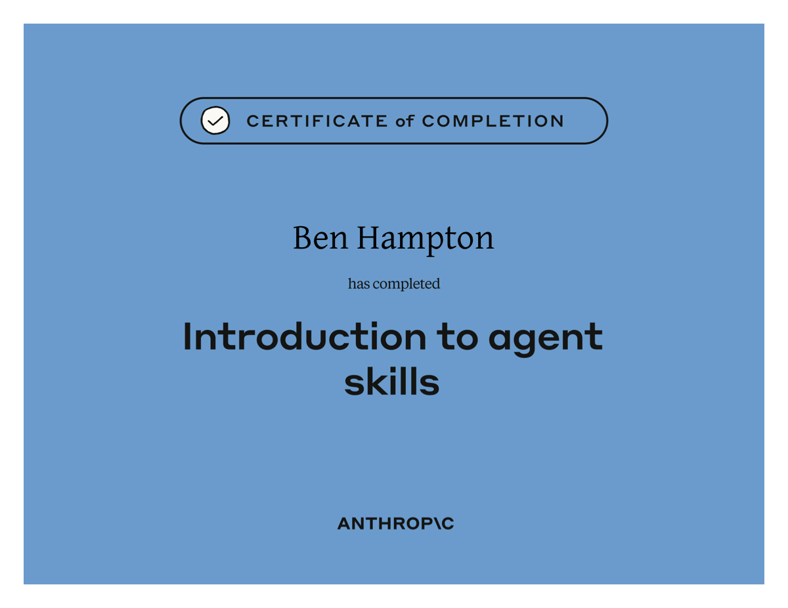
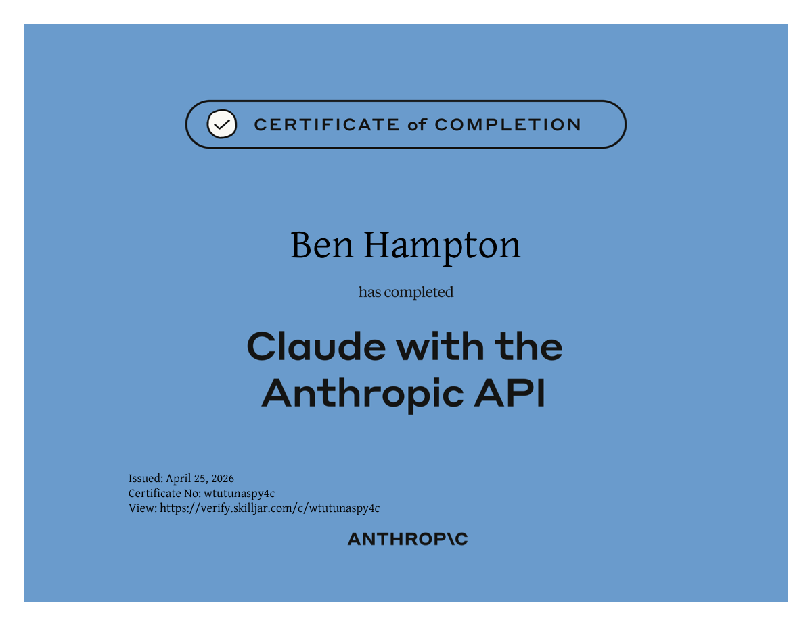
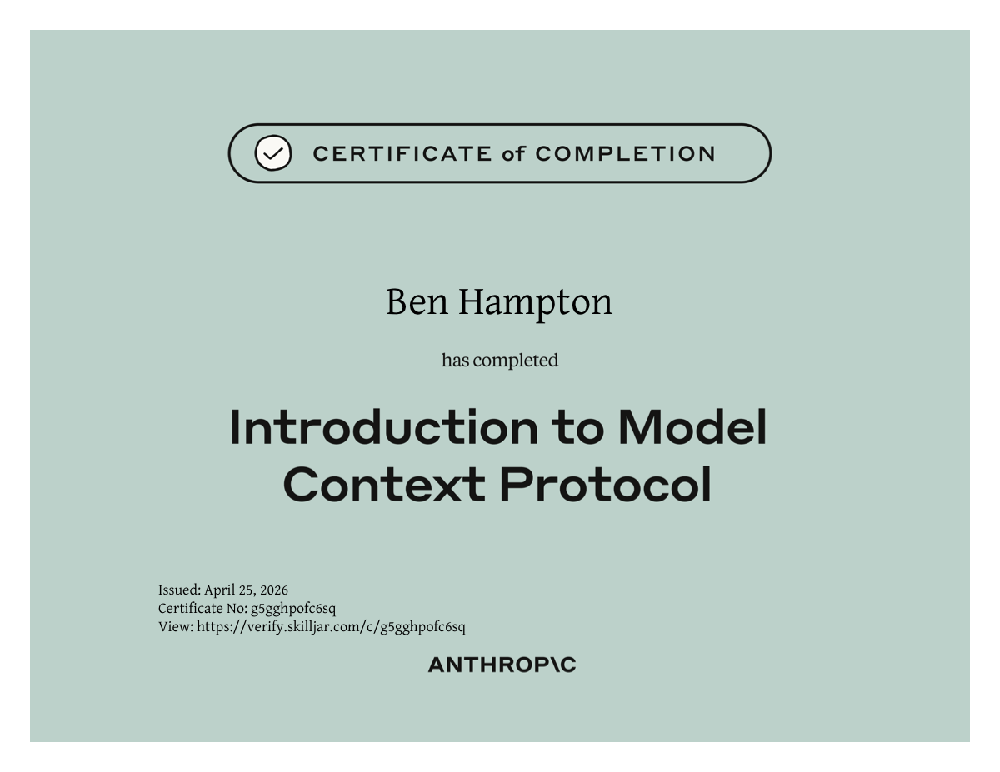
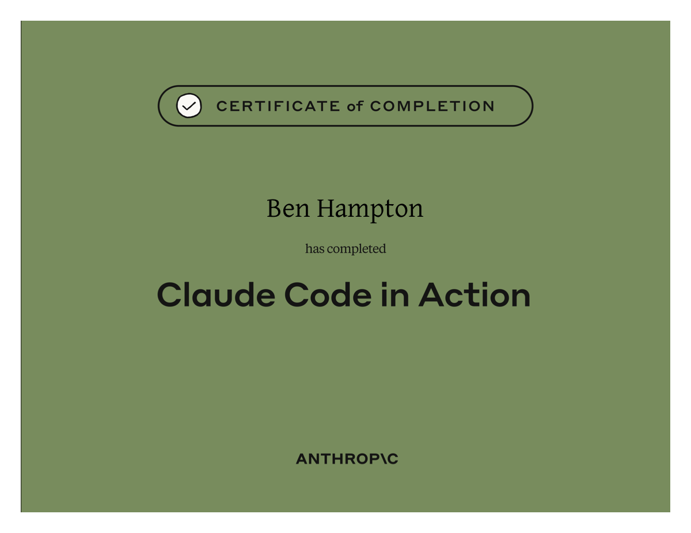

# Anthropic Academy

## Claude Partner Network Learning Path
- https://anthropic.skilljar.com/page/claude-partner-network-learning-path

### Completed 4 courses through Anthropic Academy:
1. Introduction to Agent Skills 
   - https://anthropic.skilljar.com/introduction-to-agent-skills
2. Building with the Claude API 
   - https://anthropic.skilljar.com/claude-with-the-anthropic-api
3. Introduction to Model Context Protocol 
   - https://anthropic.skilljar.com/introduction-to-model-context-protocol
4. Claude Code in Action 
   - https://anthropic.skilljar.com/claude-code-in-action

## Certifications

